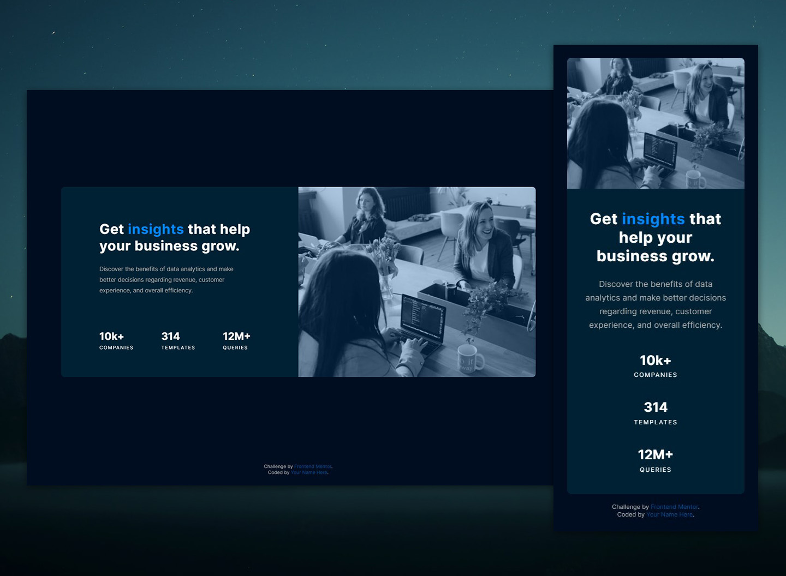

# Frontend Mentor - Stats preview card component solution

This is a solution to the [Stats preview card component challenge on Frontend Mentor](https://www.frontendmentor.io/challenges/stats-preview-card-component-8JqbgoU62). Frontend Mentor challenges help you improve your coding skills by building realistic projects.

## Table of contents

- [Overview](#overview)
  - [The challenge](#the-challenge)
  - [Screenshot](#screenshot)
  - [Links](#links)
- [My process](#my-process)
  - [Built with](#built-with)
  - [What I learned](#what-i-learned)
  - [Continued development](#continued-development)
  - [Useful resources](#useful-resources)
- [Author](#author)
- [Acknowledgments](#acknowledgments)

## Overview

### The challenge

Users should be able to:

- View the optimal layout depending on their device's screen size (375px and 1440px)

### Screenshot

Above is the final product for this challenge.

### Links

- Solution URL: [Here's my solution on Frontend Mentor](https://www.frontendmentor.io/solutions/mobilefirst-stats-card-component-build-with-css-grid-and-flexbox-gdQZs0ovU).
- Live Site URL: [Here it is in action](https://valkinsenn.github.io/frontend-mentor--stats-preview-card-component/).

## My process

### Built with

- HTML5
- Mobile-first workflow
- Custom CSS
- CSS Flexbox
- CSS Grid

### What I learned

As this was my first project on Frontend Mentor, I basically got a little bit of a refresher on CSS Grid.

### Continued development

I might go out of my way to ensure that this works on more displays than just 375px and 1440px.

### Useful resources

- [Example resource 1](https://www.example.com) - This helped me for XYZ reason. I really liked this pattern and will use it going forward.

## Author

- Website - TBD
- Frontend Mentor - [@valkinsenn](https://www.frontendmentor.io/profile/valkinsenn)
- Twitter - [@valkinsenn](https://www.twitter.com/valkinsenn)

## Acknowledgments

- **CSS Tricks**. Their guide on CSS Grid is invaluable for people either just starting to use it, and even professionals with years of experience in the field. (Yes, even Kevin Powell has to look stuff up from time to time. Everybody does.)
